# 📈 NSE Portfolio Optimization via Monte Carlo Simulation


> A quantitative finance model applying **Modern Portfolio Theory** to a basket of NSE-listed Indian equities — using Monte Carlo simulation to navigate the risk-return tradeoff and identify the **Maximum Sharpe Ratio portfolio**.

---

## The Problem

Allocating capital across multiple assets is not just about picking winners — it's about exploiting **correlation** between them. Two mediocre stocks can together form a superior portfolio if they don't move in lockstep. This project answers a precise question:

> *Given 7 major NSE-listed stocks and 10 years of historical data, what allocation of capital produces the best risk-adjusted return?*

---

## How It Works

### 1. Constructing the Efficient Frontier

The model generates **10,000 random portfolio weight vectors**, each summing to 1. For each scenario it computes:

**Annualised Return:**
```
E[Rp] = Σ wᵢ · μᵢ · 252
```

**Annualised Volatility (Portfolio Std Dev):**
```
σp = √( wᵀ · Σ · w · 252 )
```
where `Σ` is the covariance matrix of daily returns and `w` is the weight vector.

**Sharpe Ratio:**
```
S = ( E[Rp] - Rf ) / σp
```
The risk-free rate `Rf` is set to **6.6%**, reflecting the prevailing India 10-Year Government Bond yield at time of analysis.

Each scenario is plotted as a point in risk-return space. The resulting cloud of points traces the **Efficient Frontier** — the boundary of achievable portfolios.

### 2. Identifying the Optimal Portfolio

The portfolio with the **maximum Sharpe Ratio** is highlighted as the "Golden Point" — the allocation where each unit of risk taken is rewarded most efficiently.

---

## Portfolio Universe

| Ticker | Company | Sector |
|---|---|---|
| `ITC.NS` | ITC Limited | FMCG / Conglomerate |
| `VBL.NS` | Varun Beverages | Beverages |
| `TATACONSUM.NS` | Tata Consumer Products | FMCG |
| `ICICIBANK.NS` | ICICI Bank | Banking |
| `HDFCBANK.NS` | HDFC Bank | Banking |
| `RELIANCE.NS` | Reliance Industries | Energy / Retail / Telecom |
| `HINDUNILVR.NS` | Hindustan Unilever | FMCG |

Historical data spans **10 years**, sourced live via `yfinance`.

---

## Key Results

| Metric | Value |
|---|---|
| Maximum Sharpe Ratio | **1.17** |
| Risk-Free Rate Used | 6.6% (India 10Y Bond) |
| Simulation Scenarios | 10,000 |
| Data Lookback | 10 Years |

The optimal allocation skewed heavily toward high-growth names like **Varun Beverages** and **Tata Consumer**, while maintaining a stabilising allocation in **Reliance Industries** and the large-cap banks — a result consistent with the outsized return momentum seen in consumer growth stocks over the lookback window.

### Efficient Frontier



Each point represents one simulated portfolio. The colour gradient encodes Sharpe Ratio (purple → teal → yellow). The pulsing orange dot marks the maximum Sharpe allocation. The static version generated by the notebook is saved as `efficient_frontier.png`.

---

## Getting Started

### Prerequisites

```bash
pip install pandas numpy matplotlib yfinance
```

### Run the Notebook

```bash
git clone https://github.com/evans-0/Portfolio_Optimization.git
cd Portfolio_Optimization
jupyter notebook "Portfolio Optimization.ipynb"
```

Execute all cells sequentially. Data is fetched live on run — an internet connection is required.

> **Note:** `np.random.seed(10)` is set for reproducibility. The 10,000 "random" weight vectors are deterministic across runs — remove or change the seed to explore different regions of the frontier.

---

## Tech Stack

| Tool | Role |
|---|---|
| `yfinance` | Historical price data retrieval |
| `pandas` | Data wrangling and return calculation |
| `numpy` | Vectorised portfolio math (covariance, dot products) |
| `matplotlib` | Efficient Frontier visualisation |

---

## Limitations & Considerations

This project is intentionally scoped as a learning exercise. A few honest caveats:

- **Historical optimisation bias:** The maximum Sharpe portfolio is optimal *in-sample*. Past correlations and return distributions may not persist.
- **No transaction costs or constraints:** Real portfolios face minimum position sizes, brokerage fees, and liquidity constraints not modelled here.
- **Monte Carlo coverage:** 10,000 random samples provide a good approximation of the frontier but are not guaranteed to find the true mathematical optimum. Quadratic programming (e.g. via `scipy.optimize`) would yield an exact solution.
- **Sector concentration:** The universe is dominated by FMCG and Banking — results are sensitive to the characteristics of these two sectors.

---

## Disclaimer

*This project is for educational and portfolio purposes only. The results — including the 1.17 Sharpe Ratio — are based on historical data and do not constitute financial advice or a recommendation to buy or sell any securities.*

---

## License

This project is licensed under the [MIT License](LICENSE).
